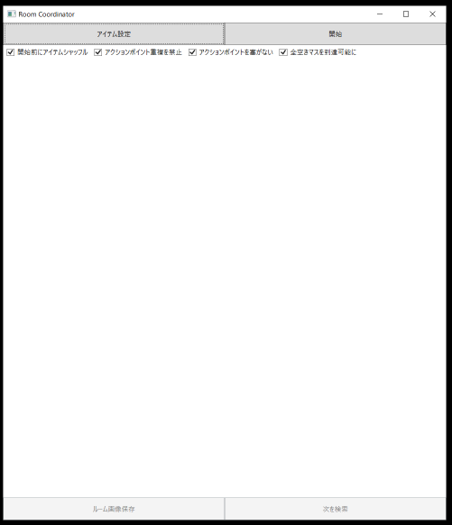
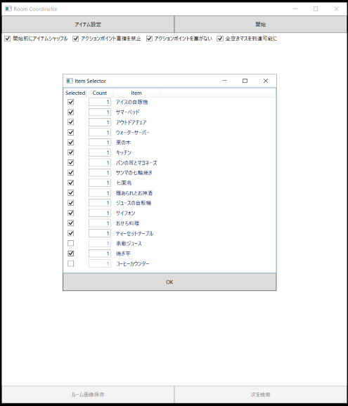
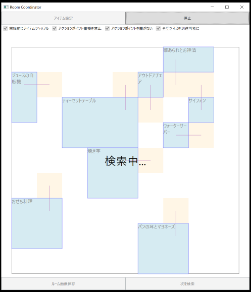
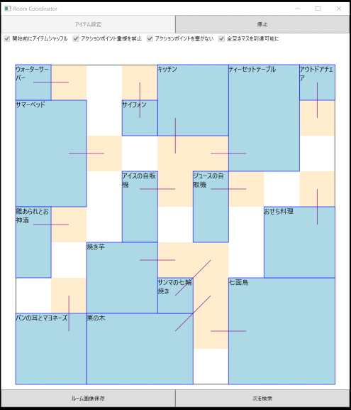
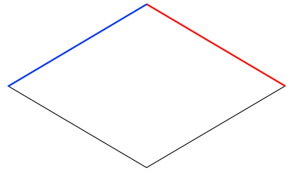
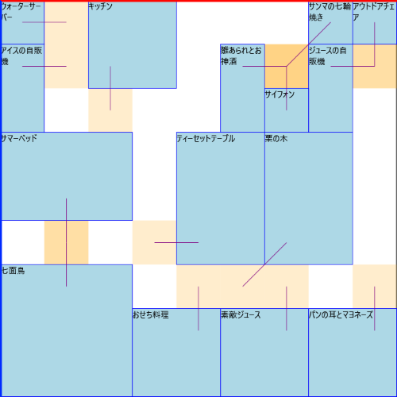

# KirafanRoomCoordinator

## スクリーンショット

[実際に動かしている動画](https://youtu.be/8ajVUYvxpao)

## 使用方法

### 必要環境

* Windows 10

### 基本手順

1. [.Net Core 3.0](https://dotnet.microsoft.com/download)をダウンロードし、インストール(実行だけならSDK／ランタイムどちらでもよい)
2. [KirafanRoomCoordinator](https://github.com/Fyed-krf/KirafanRoomCoodinator/releases/download/1.0/KirafanRoomCoordinator.zip)をダウンロードし、KirafanRoomCoordinator.exeを実行
3. アイテム設定ボタンをクリックするとアイテム設定ウインドウが開くので、ルームに設置したいアイテムを選択
4. 開始ボタンをクリックするとアイテム配置検索が開始される
5. 全アイテムを使用したアイテム配置が見つかるとウインドウに表示される
6. 次を検索ボタンをクリックすると、次の配置を検索＆表示

### ルーム表示

検索結果としてのルームは、ゲーム内のルーム表示を反時計回りに45度回転させて真上から見た状態で表示される

* ゲーム内のルーム表示

* 検索結果として表示されるルーム(赤と青の線が同じ辺に対応)

アクションポイント(※アイテム周辺に配置されているキャラアクションが発生するポイント)はオレンジ色で示され、対応するアイテムに線が引かれている。アクションポイントが重複すると段々オレンジが濃くなる。

### オプション

* 開始時にアイテムシャッフル: 有効にすると、検索開始前にルームに配置するアイテムの順番をランダムに並び換える。無効の場合、アイテム設定ウインドウのリスト順に配置される。
* アクションポイント重複禁止: 複数のアイテムのアクションポイントが重なることを禁止する
* アクションポイントを塞がない: 各アイテムのアクションポイントがルームの範囲外になったり、他のアイテムで塞がれることを禁止する
* 全空きマスを到達可能に: キャラクターがアイテムで占有されていない全てのマスに到達可能となるようにアイテムを配置する

### 画像保存

* アイテム配置が検索されるとルーム画像保存ボタンが有効となる
* ルーム画像保存ボタンをクリックすると、表示されているルームのアイテム配置をPNG画像として保存できる

### アイテム設定

アイテム設定ボタンで表示されるアイテム一覧は`items.json`ファイルに記載されている。X,Y座標の記載方法は後述のプログラムメモのルームアイテムを参照。

## ビルド

### 必要環境

* Windows 10

### ビルド手順

1. [.Net Core 3.0](https://dotnet.microsoft.com/download)のSDKをダウンロード
1. KirafanRoomCoordinatorのソースをcloneまたはダウンロード
1. KirafanRoomCoordinatorのルートディレクトリに移動
1. パッケージの復元を実行: `> dotnet restore`
1. ビルド実行: `> dotnet build`
1. ディレクトリ KirafanRoomCoordinator/KirafanRoomCoordinator/bin/Debug/netcoreapp3.0 に KirafanRoomCoodinator.exe とその他必要なファイルが出来上がる

※Visual Studio Coreや Visual Studio 2019などでもビルド可能

## プログラムメモ

### ルームアイテム

* ルームアイテムはアイテムが占有するマスのリスト(占有領域)として表現される
* アイテムの占有マスはそのアイテムのアクションポイントを原点とした2次元座標系上の座標として表現される(アイテム座標系)
* アクションポイントを持たないアイテムは、アクションポイントと占有マスが重なっていると見なして座標を定義する

### ルーム

* ルームは、N×Mの長方形(または正方形)を領域として持つ
* ルーム内の位置は左上を原点とする2次元座標系で表現される(ルーム座標系)
* ルームに配置されているアイテムは、「アイテムが置かれているルーム座標系の位置とアイテムの組」のリストとして表現される
* ルームにアイテムを追加する場合、アイテムの占有する領域の座標をアイテム座標系からルーム座標系に変換し、配置可能かのチェックを行う。アイテムの占有領域がルームの範囲外になったり、既に配置済みのアイテムの占有領域とかぶるような場所には配置できない(アクションポイントはその限りではない)。
* チェック処理の補助のため、アイテムが占有していない座標の一覧を保持しておく。アイテムの配置可否判定は、配置しようとしているアイテムのルーム座標系上の占有領域が全て「アイテムが占有していない座標の一覧」に含まれているかどうかで判断する。

### ルームの評価

アイテムが配置できるかどうかだけのルールだと、あまり面白くない配置のルームがたくさん出来てしまうため、ルームの「出来具合」を評価して合格か不合格かを判断する`IRoomReviewer`を用意し、必要に応じてルームに対して適用する。

オプションの「アクションポイント重複禁止」「アクションポイントを塞がない」「全空きマスを到達可能に」が具体的な`IRoomReviewer`の実装となっている。

### ルーム配置検索

ルーム配置検索は以下の方法で行われる

1. 初期ルーム、配置したいアイテムのリスト、配置途中ルームリストを用意する
1. 初期ルームと配置したいアイテムのリストの組(`Tuple`)を配置途中ルームリストに入れる
1. 配置途中ルームリストが空か確認し、空だったら処理を終了する(全配置パターン検索終了)
1. 配置途中ルームリストから要素を1つ取り出す(ルームとアイテムリストの1組が取り出される)
1. アイテムリストが空だったら全アイテムの配置が完了しているので、ルームに対して`IRoomReviewer`のチェックを行い、合格だった場合ルームを配置済みとして通知する。その後3に戻って処理を続ける
1. 空ではなかったらアイテムリストから1つアイテムを取り出す
1. ルームの全空きマスに対して、アイテムが配置可能かチェックを行い、配置可能な全ての場所ごとに、そのアイテムを配置したルームと残りのアイテムリストの組を配置途中ルームリストに追加する
1. 配置途中ルームリストが空になるまで3～7を繰り返す

配置途中ルームリストはスレッドセーフな`ConcurrentStack<T>`を使用し、上記3～7を並列処理することで検索効率を上げている。
